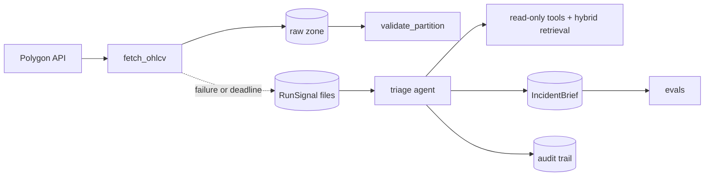

# market-ops-platform

A batch market-data platform with an AI operations layer on top.

The **data layer** pulls daily OHLCV bars for a 73-ticker universe from Polygon on an Airflow 3 schedule. It lands them in a date-partitioned raw zone and refuses to write anything it can't prove is the session it asked for. The **AI layer** turns that pipeline's failures into incident briefs: a read-only agent reads the task log, checks the partition, and retrieves the relevant runbook. Every claim it makes must cite something it actually saw, and every step lands in an audit trail. An eval harness measures whether the retrieval and the briefs are any good.

Everything runs locally in Docker. The design reasoning lives in the [decision log](ROADMAP.md#decision-log), and the two things that went wrong are written up in [docs/incidents/](docs/incidents/).

## Status

| Component | State |
|---|---|
| Dockerized Airflow 3.3.1 (Celery, Postgres, Redis) | Built, running |
| Ingestion DAG: idempotent, backfillable, vendor-validated | Built; idempotency proven by SHA-256 |
| Raw zone | 75 sessions, 2026-06-04 → 2026-09-21 |
| Incident postmortems | 2 written |
| SQL drills over the raw zone (`sql/`) | Built |
| Runbooks (`docs/runbooks/`) | Written |
| Quality checks as pure functions, alert callbacks | Scaffolded: interfaces and tests written, logic in progress |
| Hybrid retrieval, triage agent, eval harness | Scaffolded: interfaces and tests written, logic in progress |
| Golden eval sets | Written: 30 retrieval cases, 6 brief cases |
| dbt star schema | Scaffolded |

"Scaffolded" is literal. The contracts, docstrings and tests exist, and the unfinished logic raises `NotBuiltYet`, which the test suite reports as a TODO skip. `pytest -rs` prints the exact backlog, and [docs/build-order.md](docs/build-order.md) sequences it. No eval numbers are published until they're measured ([docs/eval_results.md](docs/eval_results.md)).

## Architecture



Details, trust boundaries and failure modes: [docs/architecture.md](docs/architecture.md).

## Quick start

The Airflow stack (needs `.env`; copy it from `.env.example` and fill in the keys):

```bash
docker compose up -d
```

The UI is at http://localhost:8080. The DAG needs the Connection `polygon_default`, the Variable `tickers`, and the pool `polygon` (`config/pools.json`); see [docs/runbooks/config-and-secrets.md](docs/runbooks/config-and-secrets.md).

Host-side development (tests, the agent CLI, evals):

```bash
python -m venv .venv
.venv/Scripts/pip install -r requirements-dev.txt
.venv/Scripts/python -m pytest -rs
```

## Repo map

```text
dags/                 the ingestion DAG
market_ops/           quality checks, alert callbacks, retrieval, triage agent, evals
tests/                spec tests for all of the above
docs/runbooks/        on-call runbooks (also the retrieval corpus)
docs/incidents/       postmortems
evals/golden/         golden sets for retrieval and briefs
dbt/                  staging and marts over the raw zone
sql/                  query drills against the raw zone
scripts/              partition audit (the SHA-256 idempotency proof)
ROADMAP.md            plan, current state, and the decision log
codebase-map.md       layout, contracts, conventions
```

## License

MIT
