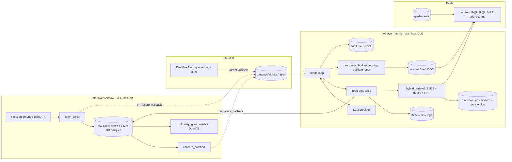

# Architecture

One system, two layers. The data layer lands market data and proves it is right. The AI layer turns the data layer's failures into grounded, auditable incident briefs, and measures whether those briefs are any good.

## Status

| Component | State |
|---|---|
| Dockerized Airflow, ingestion DAG, raw zone, idempotent writes | **Built** and running; idempotency proven by SHA-256 |
| Data-quality checks inside the DAG | **Built** inline; extraction to `market_ops/quality` is **scaffolded** |
| Two incident postmortems, the decision log | **Built** |
| Alert callbacks → RunSignal files | **Scaffolded**: contracts, tests, compose mount; logic and DAG wiring pending |
| Runbook corpus (`docs/runbooks/`) | **Written**, grounded in the decision log |
| Retrieval: chunking, BM25, dense, RRF | **Scaffolded**: corpus loader, offline embedder, wiring written; ranking logic pending |
| Triage agent: tools, guardrails, audit, loop | **Scaffolded**: contracts, tool schemas, fallback, CLI, scripted demo transcript; logic pending |
| Evals: golden sets, metrics, harness | Golden sets **written** (30 retrieval, 6 brief cases); metrics and harness loop pending |
| dbt star schema | **Scaffolded**: staging and dims written; incremental return logic pending |

"Scaffolded" means the interfaces, docstrings and tests exist, and the core logic is a `todo()` stub. `pytest -rs` lists exactly which ones.

## Trust boundaries

| Input | Trusted? | Handling |
|---|---|---|
| Vendor payload | No | Status taxonomy, market-size gate, date invariant, completeness gate: all before the write |
| Task logs, exception text, signal messages | No | Fenced as data (`fence_untrusted`) before the model sees them; flagged in the audit trail |
| Model tool arguments | No | Pydantic validation from the same schema the model was shown; path-traversal guard on log reads |
| Model output (the brief) | No | Schema-validated, then every citation checked against what the agent was actually shown |
| Our own docs | Yes | Retrieved as-is; still cited by chunk id |

The agent is **read-only by construction**. No tool writes; the only file a triage run writes is the audit trail, and the loop writes it, not a tool. State-changing recommendations (rerun, backfill, config change) require `requires_human = true`: autonomy matches reversibility.

## Failure modes and guardrails

| Failure | Guardrail | Where |
|---|---|---|
| Runaway loop or cost | Turn, tool-call and token budgets, checked before each model call | `guardrails.Budget`, `run_triage` |
| Hallucinated citation | Every evidence ref must be something a tool returned; every quote must appear in it | `validate_brief` |
| Overconfidence | "confirmed" requires first-hand evidence (log, run state, partition check) | `validate_brief` |
| Prompt injection via logs | Fence + banner + audit flag, no pattern filtering | `fence_untrusted` |
| Bad tool call | Allowlist, schema validation, errors returned to the model as text | `dispatch` |
| Model refuses, stalls, or errors | Deterministic fallback brief; a human still gets the raw signal | `fallback_brief` |
| Alerting path broken | Callbacks log and swallow; never mask the task's real error | `on_task_failure`, `on_deadline_missed` |
| Silent quality regression | Golden sets, per-tag metrics, before/after protocol | `market_ops/evals`, `evals/README.md` |

## What I'd do differently at scale

None of this is built. It's where the current design would change first.

- **Signals via a queue or the Airflow REST API**, not files, once there is more than one consumer. `AirflowApiRunSource` is the first step.
- **A vector database with an ANN index** at roughly 10^5+ chunks. Below that, exact numpy search is faster to build and loses no recall.
- **A shared service behind the identity provider** instead of a local CLI, when more than one team uses it: per-user access, one audit trail, one version.
- **Evals in CI** on every prompt, model or retrieval change, blocking merges that regress the golden sets.
- **A warehouse with partition and cluster keys** (Snowflake or BigQuery) instead of local DuckDB once data outgrows one machine; the partition-pruning lesson in docs/query-cost.md carries over directly.
