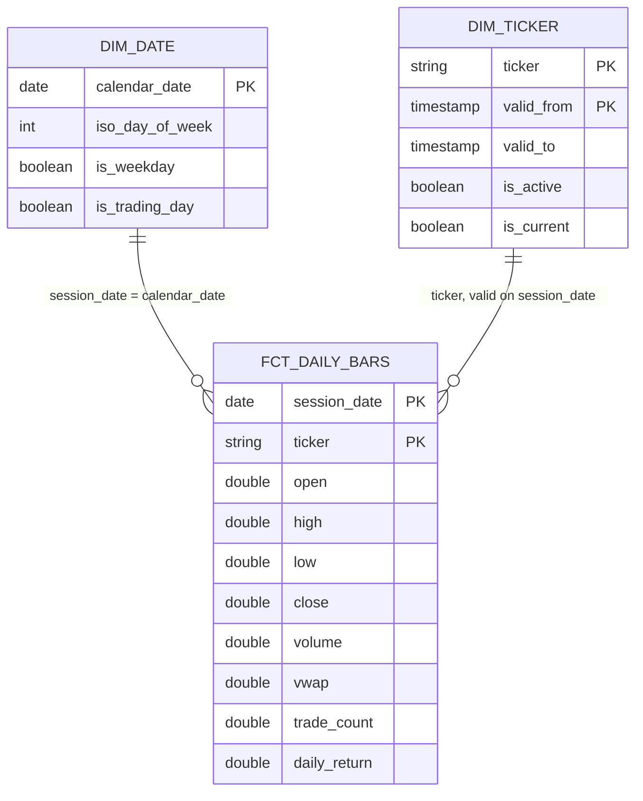

# Data model

The warehouse is a small star schema over the raw zone, built by dbt into DuckDB (`dbt/`). Grain first, always.

## Grain

| Table | Type | Grain | Key |
|---|---|---|---|
| `fct_daily_bars` | Fact | One row per ticker per trading session | (session_date, ticker) |
| `dim_date` | Dimension | One row per calendar date in the loaded range | calendar_date |
| `dim_ticker` | Dimension (SCD2) | One row per version of a ticker's membership | (ticker, valid_from) |
| `stg_ohlcv` | Staging view | One row per ticker per session, as landed | (session_date, ticker) |

## Star schema

## Decisions

### Natural keys, not surrogates

`(session_date, ticker)` is stable, meaningful, and already the raw zone's grain and partition layout. At this scale a surrogate key adds a lookup and a join without solving a problem. Surrogates earn their place when natural keys change (a ticker rename) or are composite across many facts. TODO(owner): revisit if ticker renames ever need to be tracked as one entity.

### SCD Type 2 for ticker membership

Membership changes over time. ANSS left the universe on 2026-09-16, and "what were we tracking on 2026-08-01?" must still have an answer. A dbt snapshot (`check` strategy on `is_active`) keeps a validity window per version. ANSS stays in the seed with `is_active = false` rather than being deleted, so the change is an ordinary new version rather than a hard delete. TODO(owner): backdate the initial `valid_from` to each ticker's first session, since the first snapshot run stamps them all with the run time.

### Incremental fact with a lookback window

A partition can be re-derived for a past session (a backfill). An incremental model that only loads `session_date > max(session_date)` would silently skip that correction. The model rebuilds a lookback window on every run and uses delete+insert on the grain. TODO(owner): size the window in sessions, from how far back backfills actually reach.

The LAG trap: `daily_return` needs the previous session's close. Inside an incremental run, the first session of the window has no previous row in scope, so LAG returns null. The fix is to select one extra session of context, compute the LAG, then keep only the window's rows.

### Trading days come from the data

`dim_date.is_trading_day` is true when the vendor returned bars for that date: the same "ask the vendor, don't import a calendar" decision the DAG makes. The gap: a weekday with no partition is either a holiday or a missed load, and the warehouse alone can't tell which. TODO(owner): record the vendor's "closed" answer (the skipped run) so holidays and gaps can be told apart.

## Data-quality dimensions mapped to controls

| Dimension | Control | Where |
|---|---|---|
| Accuracy | Response date equals requested session; row date equals partition | DAG `fetch_ohlcv`, `validate_partition`; `assert_bar_date_matches_partition` |
| Completeness | ≥20% of tickers missing fails; any miss warns; < 8000 market rows fails | DAG `fetch_ohlcv` |
| Uniqueness | (date, ticker) grain | DAG `validate_partition`; `unique_combination` |
| Timeliness | Deadline alert on queued runs (scaffolded); source freshness (TODO) | `market_ops/alerts/deadlines.py`; `_sources.yml` |
| Consistency | Single schema across all partitions; pinned column order | DAG `OHLCV_COLUMNS`; DuckDB union scan |
